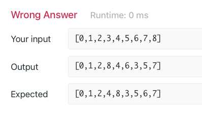

# 1356. Sort Integers by The Number of 1 Bits

[問題](https://leetcode.com/problems/sort-integers-by-the-number-of-1-bits/)

## 解答の方針
1. map[int]intを作る
2. 与えられた値をbitの文字列に変換する
3. keyに与えられた数値, valueに1 bitのカウントを格納する
4. valueでソートして、keyから新たなarrayを作る

## 実装
```go
import "sort"

func sortByBits(arr []int) []int {
	bitMap := make(map[int]int, len(arr))

	// bitカウントの処理
	for _, v := range arr {
		str := fmt.Sprintf("%b", v)
		count := 0
		for _, v := range str {
			if string(v) == "1" {
				count++
			}
		}

		bitMap[v] = count
	}

	// ソートの処理
	keys := make([]int, 0, len(arr))
	for key := range bitMap {
		keys = append(keys, key)
	}

	sort.SliceStable(keys, func(i, j int) bool {
		return bitMap[keys[i]] < bitMap[keys[j]]
	})

	array := make([]int, len(keys))
	for i, k := range keys {
		array[i] = k
	}
	return array
}
```

sortが不安定なので、不正解になる。



## 改善

[ここのコード](https://leetcode.com/problems/sort-integers-by-the-number-of-1-bits/discuss/1059759/Golang-solution-faster-than-100/)を参考にする。


```go
func sortByBits(arr []int) []int {
	h := [501][]int{} // has 501 arrays because the max length of arr is 500

	for _, i := range arr {
		n := i
		numBits := 0
		for n > 0 {
			numBits += n & 1
			n >>= 1
		}
		h[numBits] = append(h[numBits], i)
	}

	arrayCounter := 0

	for i := 0; i < len(h); i++ {
		sort.Ints(h[i])
		for j := 0; j < len(h[i]); j++ {
			arr[arrayCounter] = h[i][j]
			arrayCounter++
		}
		if arrayCounter == len(arr) {
			break
		}
	}

	return arr
}
```

それと[ここ](https://leetcode.com/problems/sort-integers-by-the-number-of-1-bits/discuss/518170/go-sort-slice-100/)


```go
func sortByBits(arr []int) []int {
    sort.Slice(arr, func(i, j int) bool {
        iCount, jCount := getBit1Count(arr[i]), getBit1Count(arr[j])
        if iCount == jCount {
            return arr[i] < arr[j]
        }
        return iCount < jCount
    })
    return arr
}

func getBit1Count(val int) (count int) {
    for val != 0 {
        count += val & 0x1
        val >>= 1
    }
    return
}
```


下記の部分を転用して、解答のコードに反映する。
```go
if iCount == jCount {
	return arr[i] < arr[j]
}
```


## 改善後のコード
1. mapは不要
2. bitを文字列に変換する必要なし


```go
func sortByBits(arr []int) []int {
  sort.Slice(arr, func(i, j int) bool {
    iCount, jCount := getBitCount(arr[i]), getBitCount(arr[j])
    // bitのカウントが重複した場合は、元の数値で並び替えする
    if iCount == jCount {
      return arr[i] < arr[j]
    }

	// bitのカウントで並び替えする
    return iCount < jCount
  }) 
  return arr
}

func getBitCount(x int) (count int) {
  for x != 0 {
    count += x & 1
    x >>= 1
  }
  return 
}
```

## ポイント
ビット列の演算は、
```go
var n int
n >>= 1 // 1ビット右シフト
```

ソートは、
```go
sort.Slice(arr, func(i, j int) bool {
	return arr[i] < arr[j] // ascで並び替え
})
```